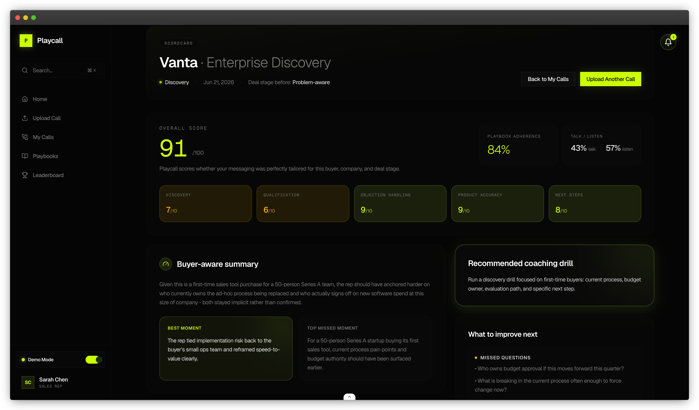

<a href="https://playcall.dphenomenal.com">
  
  <h1 align="center">Playcall</h1>
</a>

<p align="center">
  Score sales calls against your actual playbook and buyer context, not generic AI advice.
</p>

<p align="center">
  <strong><a href="https://playcall.dphenomenal.com">Demo</a></strong> ·
  <strong><a href="#setup">Setup</a></strong> ·
  <strong><a href="#deploying-to-production">Deploy</a></strong> ·
  <strong><a href="SECURITY.md">Security</a></strong>
</p>

## Stack

- **Framework**: Next.js 16 (App Router) + React 19
- **Database / Auth**: Supabase (Postgres, Auth, RLS, Edge Functions)
- **AI**: Vercel AI SDK — OpenAI, Anthropic, and 15 other providers; BYOK per workspace
- **Document parsing**: LlamaParse (PDF, DOCX, PPTX, images, 130+ formats)
- **Audio transcription**: OpenAI Whisper
- **File uploads**: Vercel Blob
- **Enrichment**: Exa or TheHog (buyer/company context)
- **UI**: Tailwind CSS + shadcn/ui

## Prerequisites

- Node.js 20+ and pnpm
- [Supabase](https://supabase.com) account
- [Vercel](https://vercel.com) account
- [OpenAI](https://platform.openai.com/api-keys) API key (scoring + audio transcription)
- [LlamaParse](https://cloud.llamaindex.ai) API key (free tier: 10k credits/month)
- Enrichment key — [Exa](https://exa.ai) (`EXA_API_KEY`) or [TheHog](https://thehog.ai) (`THEHOG_ACCESS_KEY` + `THEHOG_SECRET_KEY`)

## Setup

### 1. Clone and install

```bash
git clone https://github.com/Dphenomenal101/playcall.git
cd playcall
pnpm install
```

### 2. Create a Supabase project

Go to [supabase.com/dashboard](https://supabase.com/dashboard) → **New project**. Once provisioned:

- **Authentication → URL Configuration**: set Site URL and add your domain to Redirect URLs (e.g. `https://yourdomain.com/auth`)
- **Authentication → Email Settings**: enable a custom SMTP provider — Supabase's built-in sender is rate-limited on the free tier

### 3. Apply the database schema

```bash
# Install the Supabase CLI if you don't have it: https://supabase.com/docs/guides/cli
supabase login
supabase link --project-ref <your-project-ref>   # Project Settings → General
supabase db push
```

### 4. Deploy the Edge Function

```bash
supabase functions deploy process-job
```

Set the secrets the function needs. `WORKSPACE_SECRETS_ENCRYPTION_KEY` must be the **same value** you set in your app environment — the Edge Function uses it to decrypt BYOK credentials:

```bash
supabase secrets set WORKSPACE_SECRETS_ENCRYPTION_KEY=your_key
supabase secrets set OPENAI_API_KEY=your_key
# Optional
supabase secrets set ANTHROPIC_API_KEY=your_key
supabase secrets set EXA_API_KEY=your_key
# or TheHog:
supabase secrets set THEHOG_ACCESS_KEY=your_key
supabase secrets set THEHOG_SECRET_KEY=your_key
```

### 5. Set up Vercel Blob

1. Create a Vercel project for this repo at [vercel.com/new](https://vercel.com/new)
2. **Storage → Create → Blob** → connect to project
3. Pull env vars locally — this writes `BLOB_READ_WRITE_TOKEN` to `.env.local`:

```bash
vercel link
vercel env pull .env.local
```

### 6. Configure environment variables

`.env.local` now has your Blob token. Add the remaining required values — use `.env.example` as the reference for what's needed and why:

**Supabase** — from **Project Settings → API**:

- `NEXT_PUBLIC_SUPABASE_URL`
- `NEXT_PUBLIC_SUPABASE_ANON_KEY`
- `SUPABASE_SERVICE_ROLE_KEY`

**LlamaParse** — from [cloud.llamaindex.ai](https://cloud.llamaindex.ai):

- `LLAMA_CLOUD_API_KEY` — your API key
- `LLAMA_CLOUD_WEBHOOK_SECRET` — generate with `openssl rand -hex 32`
- `LLAMA_CLOUD_WEBHOOK_URL` — set to `https://yourdomain.com/api/webhooks/llamaparse` (or your ngrok URL for local dev)

**App URL**:

- `NEXT_PUBLIC_APP_URL` — your app's public base URL. Set to `http://localhost:3000` for local dev, and your deployed domain (e.g. `https://yourdomain.com`) in production. Used for invite links and the LlamaParse webhook URL.

**Other secrets** — generate locally:

```bash
openssl rand -base64 32   # → WORKSPACE_SECRETS_ENCRYPTION_KEY (must match step 4)
openssl rand -hex 16      # → CRON_SECRET
```

### 7. Run locally

```bash
pnpm dev
```

Open [localhost:3000](http://localhost:3000) and complete the manager onboarding flow.

## Deploying to production

[](https://vercel.com/new/clone?repository-url=https://github.com/Dphenomenal101/playcall&env=NEXT_PUBLIC_SUPABASE_URL,NEXT_PUBLIC_SUPABASE_ANON_KEY,SUPABASE_SERVICE_ROLE_KEY,NEXT_PUBLIC_APP_URL,WORKSPACE_SECRETS_ENCRYPTION_KEY,CRON_SECRET,LLAMA_CLOUD_API_KEY,LLAMA_CLOUD_WEBHOOK_SECRET,LLAMA_CLOUD_WEBHOOK_URL,OPENAI_API_KEY&envDescription=See%20.env.example%20for%20full%20descriptions.%20BLOB_READ_WRITE_TOKEN%20is%20injected%20automatically%20once%20you%20connect%20a%20Vercel%20Blob%20store.&envLink=https://github.com/Dphenomenal101/playcall/blob/main/.env.example)

1. Click the button above (or import your repo at [vercel.com/new](https://vercel.com/new))
2. **Storage → Create → Blob** → connect to your project (`BLOB_READ_WRITE_TOKEN` is injected automatically)
3. **Project Settings → Environment Variables** — add everything from `.env.local`, but set `NEXT_PUBLIC_APP_URL` to your deployed domain (not `http://localhost:3000`)
4. Push to your default branch — Vercel deploys automatically and activates the daily keep-alive cron that prevents free-tier Supabase projects from pausing

## Project structure

```
app/
  manager/        Manager dashboard, onboarding, playbooks, settings
  rep/            Rep dashboard, call upload, scorecard
  api/            Route handlers, webhooks, cron
lib/
  data/           Supabase read/write logic
  ai/             Provider registry, BYOK config resolution
  enrichment/     Exa and TheHog enrichment providers
  integrations/   LlamaParse and third-party API clients
  extraction/     Whisper audio transcription + plain-text file reading
  security/       Credential encryption at rest
  jobs/           Async job dispatch
components/       Shared UI components
supabase/
  migrations/     Database schema
  functions/      Edge Functions (process-job)
```

## Contributing

Contributions are welcome.

1. Fork the repo and create a feature branch.
2. Run the app locally and verify your change in context.
3. Keep changes focused and include any docs updates that make the behavior clearer.
4. Open a pull request with a concise summary of what changed and why.

If your change affects setup, deployment, or security assumptions, update [README.md](README.md) and [SECURITY.md](SECURITY.md) in the same PR.

For security issues, do not open a public issue. Follow the reporting guidance in [SECURITY.md](SECURITY.md).

## License

[MIT](LICENSE)
